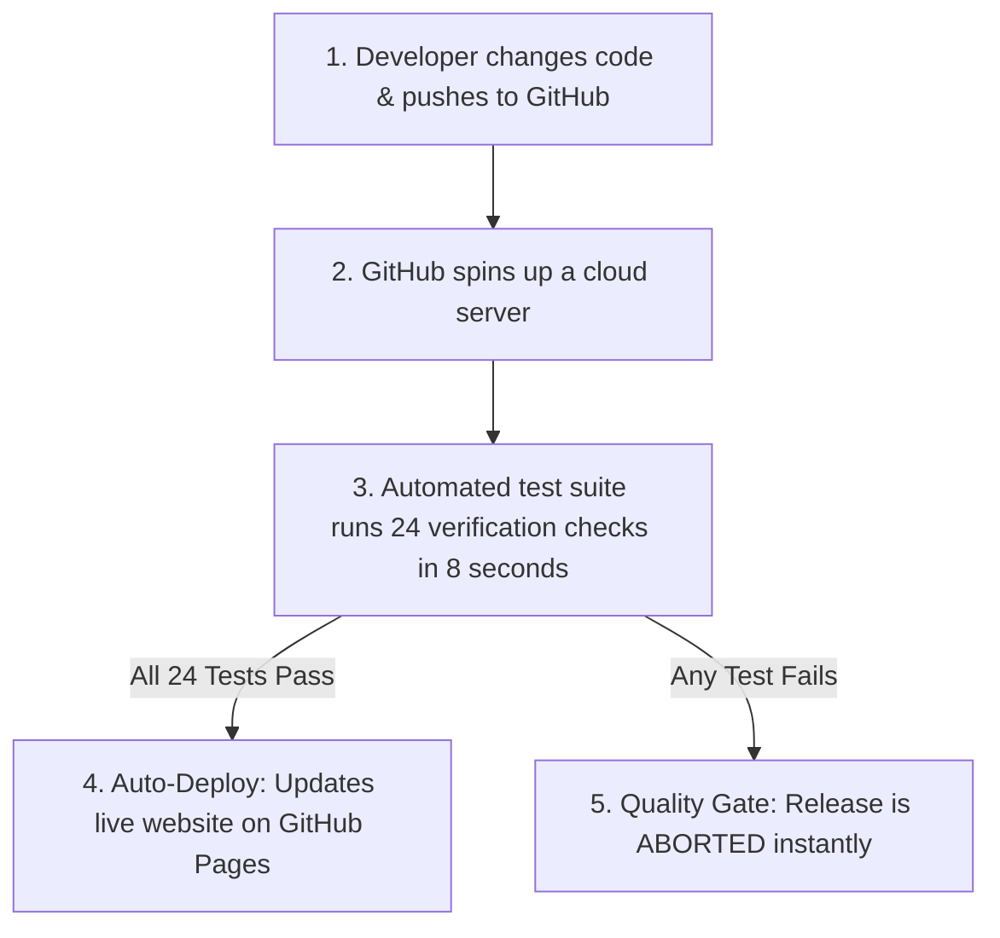

# Automated CI/CD Pipeline & Quality Gate: Plain-English Guide

> **Quick Summary:**  
> This project demonstrates how modern software companies deploy applications safely without human error or bugs crashing the live website. It uses an **automated quality gate** that tests every code update before deciding whether to publish it to real users.

---

## 💡 The Big Idea: The "Airport Security" Analogy

Imagine an airport terminal. You wouldn't let passengers walk straight onto an airplane without passing through airport security and baggage scanners first.

In software, **CI/CD** is that airport security checkpoint:

```
Developer writes code ──► [ Automated Security / Test Scanner ] ──► [ Pass? ] ──► Live Website
                                                                          │
                                                                   [ Fail? ] ──► BLOCKED 🛑
```

* **Without this system:** Developers push updates directly to the live website. If they make a small typo or mistake, the live site breaks for thousands of users.
* **With this system:** An automated robot inspects and tests the code in seconds. If everything is 100% healthy, it publishes the update automatically. If there is even one error, it blocks the release immediately.

---

## ❓ What Problem Does This Solve?

In traditional software development:
1. **Human Oversight:** Developers can get tired or miss edge cases when testing manually by clicking around a screen.
2. **Broken Deployments:** Bugs often reach production, causing downtime, user frustration, and lost revenue.
3. **Slow Releases:** Fear of breaking things makes teams deploy slowly and infrequently.

**CI/CD (Continuous Integration / Continuous Deployment)** solves this by automating both the **verification** and the **delivery** of software.

---

## 🛠️ How This Project Works in 3 Steps

This repository uses a simple task manager web app as a demonstration model. Here is how the automated pipeline handles every change:



### 1. Verification (Continuous Integration - CI)
Whenever code is updated or submitted through a Pull Request, GitHub automatically launches an isolated cloud environment and runs **24 automated unit tests**. These tests check rules like:
* Can a user submit a blank or invisible task? (Blocked)
* Can a task exceed 100 characters? (Blocked)
* Do task checkboxes, filters, and deletions work as expected? (Verified)

### 2. The Quality Gate (The Safety Net)
* If **all 24 checks pass**, the build turns **Green ✅**.
* If **even one check fails**, the build turns **Red ❌** and deployment is forbidden.

### 3. Automated Delivery (Continuous Deployment - CD)
Once the code passes all quality checks and is approved into the `main` branch, the system deploys the newest version of the website live to the internet with **zero manual file uploads**.

---

## 📂 Project Structure Explained Simply

| File / Folder | What it is in plain English |
| :--- | :--- |
| **`index.html` & `css/style.css`** | The user interface (what users see and interact with in the browser). |
| **`js/logic.js`** | The "brain" containing the core rules (how tasks are added, validated, and counted). |
| **`js/app.js`** | The bridge that connects the brain to the screen and saves tasks in the browser. |
| **`tests/logic.test.js`** | The automated robot checklist (24 tests checking every scenario). |
| **`.github/workflows/cicd.yml`** | The master recipe instructions telling GitHub when to test and when to deploy. |

---

## 🧪 Proven in Action: What We Demonstrated

During testing of this pipeline, two scenarios were executed:

1. **Successful Automated Release:**  
   Clean code was pushed to the repository. The automated test suite completed in **8 seconds**, all 24 tests passed, and the website was automatically deployed live to GitHub Pages.

2. **Intercepted Bug (Quality Gate in action):**  
   A deliberate bug was introduced on a test branch (allowing invalid/empty tasks). A Pull Request was created. The CI pipeline caught the bug immediately, turned **Red**, and **blocked the merge and deployment**, protecting the live production site.

---

## 🌟 Key Business Benefits

* 🚀 **Speed:** Features and bug fixes can be delivered to users in minutes rather than days.
* 🛡️ **Reliability:** Automated tests prevent human error and prevent regression bugs.
* 💰 **Cost Efficiency:** Automated pipelines run on cloud infrastructure without requiring manual server management.
* 😌 **Confidence:** Developers and managers know that broken code cannot sneak into production unnoticed.

---

## 📖 Plain-English Glossary

* **CI (Continuous Integration):** Automatically testing and verifying every piece of code as soon as it is written.
* **CD (Continuous Deployment):** Automatically releasing verified code directly to live users without manual intervention.
* **Quality Gate:** An automated checkpoint that must be passed before software is allowed to advance to the next stage.
* **Unit Test:** A mini-experiment written in code that tests whether a specific function behaves correctly.
* **GitHub Actions:** GitHub's built-in cloud service that executes automated workflows like testing and deployment.
